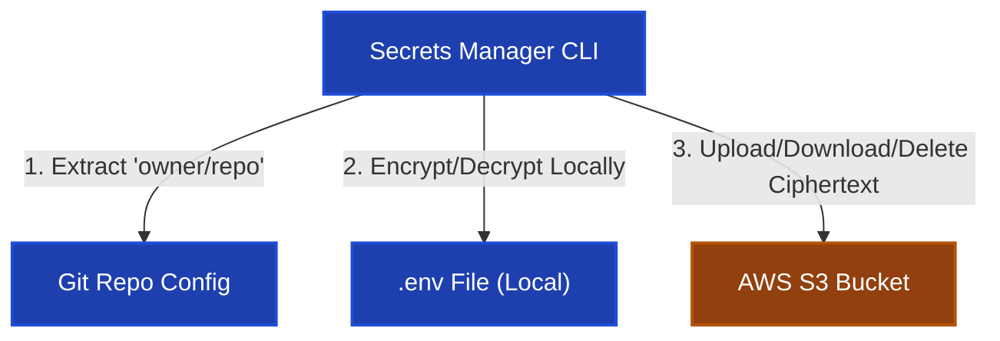
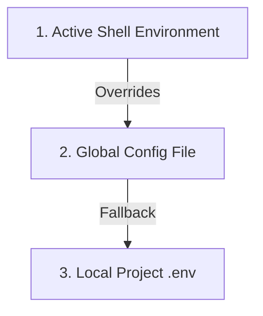

# 🔐 Secrets Manager Architecture

Welcome to **Secrets Manager**. This project is a secure CLI tool designed to encrypt, upload, fetch, and delete repository-specific environment (`.env`) files using an AWS S3 bucket.

This document serves as the high-level portal to help you understand the project scope, codebase directory structure, system architecture, and onboarding steps.

---

## 🎯 Project Scope & Core Design

The project solves the problem of sharing sensitive `.env` files across distributed developer teams without committing credentials to Git or storing plain text files in shared buckets.

### Key Architectural Choices:

1.  **Zero-Knowledge Remote Storage**: No master passwords, password hashes, or plaintext secrets ever leave the local machine. S3 stores only encrypted ciphertext.
2.  **Symmetric Cryptography**: Files are encrypted locally using Fernet (AES-128 in CBC mode + HMAC-SHA256).
3.  **Dynamic Key Derivation**: Keys are derived locally from user-supplied passwords and random 16-byte salts using PBKDF2 (SHA-256, 480,000 iterations).
4.  **Generalized Repo Mapping**: S3 objects are keyed by the SHA-1 hash of the normalized Git repository path (`owner/repo`), enabling developers using different transport protocols (HTTPS, SSH, custom configs) to access the same shared secrets.

---

## 🏗️ High-Level System Architecture



---

## 📂 Codebase Directory Structure

```text
secretMan/
├── pyproject.toml              # Project dependencies & CLI entrypoints configuration
├── uv.lock                     # Lockfile for reproducible environment setup
├── AGENT.md                    # This onboarding guide
├── scripts/
│   ├── install.py              # Cross-platform installation and S3 config setup 
│   └── uninstall.py            # Clean uninstallation and config removal script
├── src/
│   └── secrets_manager/
│       ├── __init__.py
│       ├── cli/
│       │   ├── upload.py       # 'suenv' entrypoint: local file encryption & upload
│       │   ├── fetch.py        # 'sfenv' entrypoint: S3 download & local decryption
│       │   └── delete.py       # 'sdenv' entrypoint: local verification & S3 deletion
│       └── utils/
│           ├── aws_client.py   # Boto3 client initialization & S3 bucket helper
│           └── helpers.py      # Git URL parsing, hash generation, password prompts, and KDF
└── docs/
    ├── cli-guide.md            # Detailed CLI usage commands, flags, and options
    └── auth-and-encryption.md  # Detailed KDF key derivation steps & process flowcharts
```

---

## 🔑 Onboarding & Setup

You can set up the tool automatically using the provided installation script, or manually.

### 1. Automatic Setup (Recommended)

Run the cross-platform setup script to check dependencies, globally install the CLI tool, and interactively configure S3 keys:

```bash
python scripts/install.py
```

### 2. Manual Setup

If you prefer to configure manually:

1. Register CLI tools globally: `pipx install .`
2. Create the configuration directory at `~/.secrets-manager/`.
3. Create a `.env` file inside it containing the following keys (or configure them as local project fallback `.env` keys):
   - `AWS_ACCESS_KEY` & `AWS_SECRET_ACCESS_KEY`: Credentials for AWS S3 access.
   - `AWS_DEFAULT_REGION`: S3 bucket region.
   - `AWS_S3_BUCKET_NAME`: Target S3 bucket.
   - `FERNET_SALT` _(Optional fallback)_: Used only to decrypt older files that lack embedded salt metadata.

### 🗑️ Teardown / Uninstallation

To cleanly remove all global CLI packages and wipe your local `~/.secrets-manager/` folder:

```bash
python scripts/uninstall.py
```

---

## ⚙️ Configuration Resolution Hierarchy

When executing commands, the Secrets Manager CLI resolves its S3 storage credentials and keys from three potential sources. To prevent mixing environment contexts, the priority is strictly resolved in the following order:



1.  **Active Shell Environment Variables (Priority 1 - Highest)**:
    *   Standard shell-exported keys (like `AWS_ACCESS_KEY` or `AWS_S3_BUCKET_NAME`) take absolute precedence. This allows direct integration with global AWS profiles and variables set in your `~/.bashrc` / `~/.zshrc`.
2.  **Global Configuration File (Priority 2 - Medium)**:
    *   Stored in `~/.secrets-manager/.env`. If shell variables are not present, keys are retrieved from here. This allows global CLI access without duplicating keys in project directories.
3.  **Local Project File (Priority 3 - Lowest)**:
    *   Stored in `.env` in the current working directory. Used as a fallback if the global config file is missing.

---

## 📂 Deep-Dive Documentation

For more specialized details, please refer to:

- **[CLI Reference Guide](docs/cli-guide.md)**: Exhaustive manual for CLI commands, flags, overwrite protection, and delete prompts.
- **[Authentication & Encryption Flow Guide](docs/auth-and-encryption.md)**: Deep-dive into KDF key derivation, cryptographic choices, S3 metadata format, and Mermaid sequence flows.
