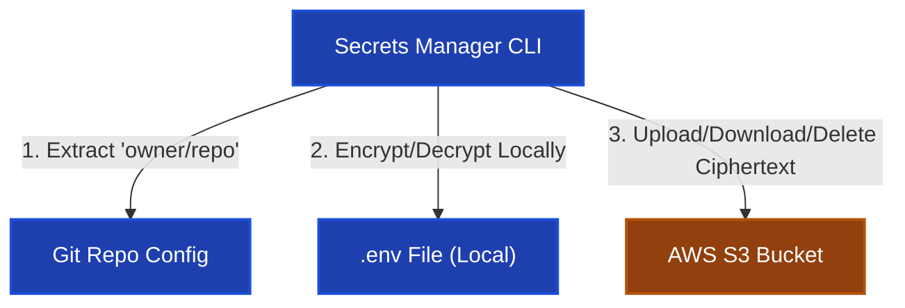

# 🔐 Secrets Manager Architecture

Welcome to **Secrets Manager**. This project is a secure CLI tool designed to encrypt, upload, fetch, and delete repository-specific environment (`.env`) files using an AWS S3 bucket.

This document serves as the high-level portal to help you understand the project scope, codebase directory structure, system architecture, and onboarding steps.

---

## 🎯 Project Scope & Core Design

The project solves the problem of sharing sensitive `.env` files across distributed developer teams without committing credentials to Git or storing plain text files in shared buckets.

### Key Architectural Choices:

1.  **Zero-Knowledge Remote Storage**: No master passwords, password hashes, or plaintext secrets ever leave the local machine. S3 stores only encrypted ciphertext.
2.  **Symmetric Cryptography**: Files are encrypted locally using Fernet (AES-128 in CBC mode + HMAC-SHA256).
3.  **Dynamic Key Derivation**: Keys are derived locally from user-supplied passwords and random 16-byte salts using PBKDF2 (SHA-256, 480,000 iterations).
4.  **Generalized Repo Mapping**: S3 objects are keyed by the SHA-1 hash of the normalized Git repository path (`owner/repo`), enabling developers using different transport protocols (HTTPS, SSH, custom configs) to access the same shared secrets.

---

## 🏗️ High-Level System Architecture



---

## 📂 Codebase Directory Structure

```text
secretMan/
├── pyproject.toml              # Project dependencies & CLI entrypoints configuration
├── uv.lock                     # Lockfile for reproducible environment setup
├── AGENT.md                    # This onboarding guide
├── src/
│   └── secrets_manager/
│       ├── __init__.py
│       ├── cli/
│       │   ├── upload.py       # 'suenv' entrypoint: local file encryption & upload
│       │   ├── fetch.py        # 'sfenv' entrypoint: S3 download & local decryption
│       │   └── delete.py       # 'sdenv' entrypoint: local verification & S3 deletion
│       └── utils/
│           ├── aws_client.py   # Boto3 client initialization & S3 bucket helper
│           └── helpers.py      # Git URL parsing, hash generation, password prompts, and KDF
└── docs/
    ├── cli-guide.md            # Detailed CLI usage commands, flags, and options
    └── auth-and-encryption.md  # Detailed KDF key derivation steps & process flowcharts
```

---

## 🔑 Onboarding Configuration Requirements

To run this tool, you must configure the following environment variables (usually stored in your local system environment or a global configuration space):

- `AWS_ACCESS_KEY` & `AWS_SECRET_ACCESS_KEY`: Credentials for AWS S3 access.
- `AWS_DEFAULT_REGION`: S3 bucket region.
- `AWS_S3_BUCKET_NAME`: Target S3 bucket.
- `FERNET_SALT` _(Optional fallback)_: Used only to decrypt older files that lack embedded salt metadata.

---

## 📂 Deep-Dive Documentation

For more specialized details, please refer to:

- **[CLI Reference Guide](docs/cli-guide.md)**: Exhaustive manual for CLI commands, flags, overwrite protection, and delete prompts.
- **[Authentication & Encryption Flow Guide](docs/auth-and-encryption.md)**: Deep-dive into KDF key derivation, cryptographic choices, S3 metadata format, and Mermaid sequence flows.
