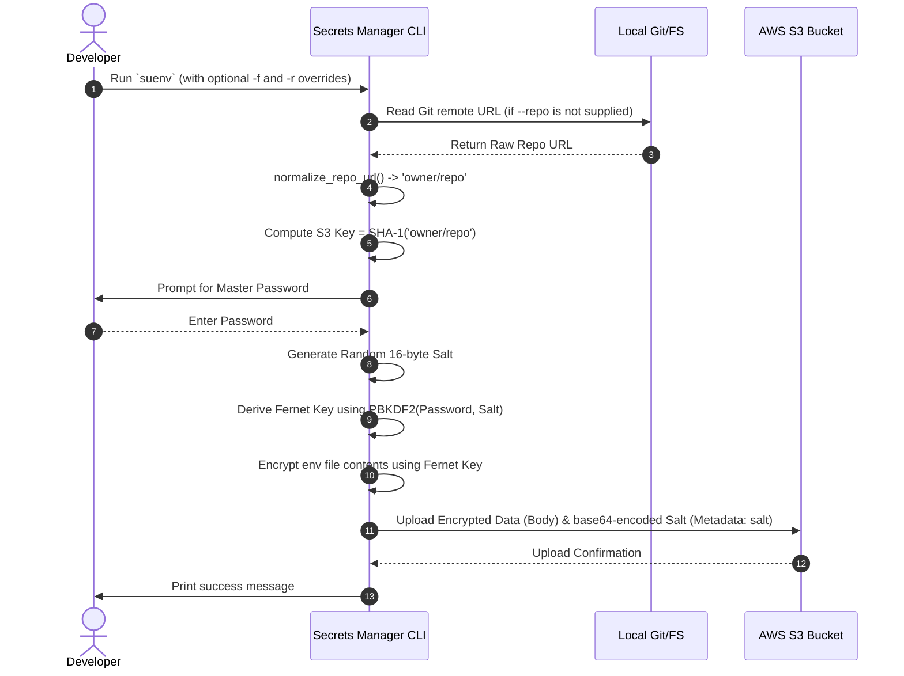
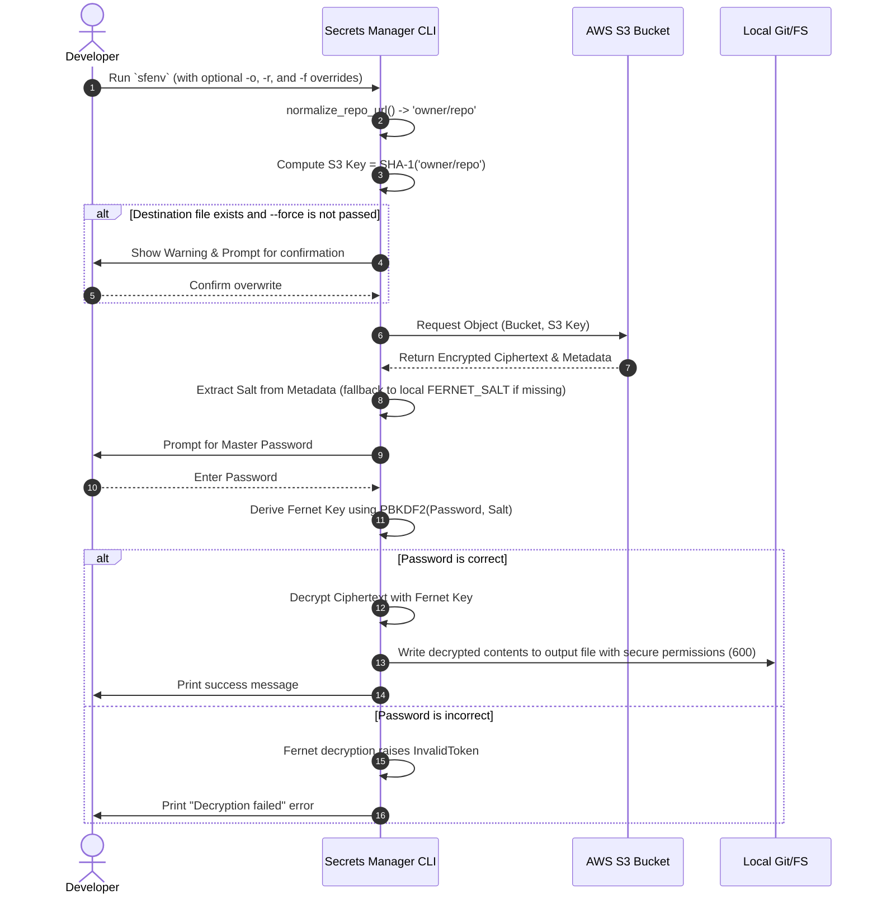
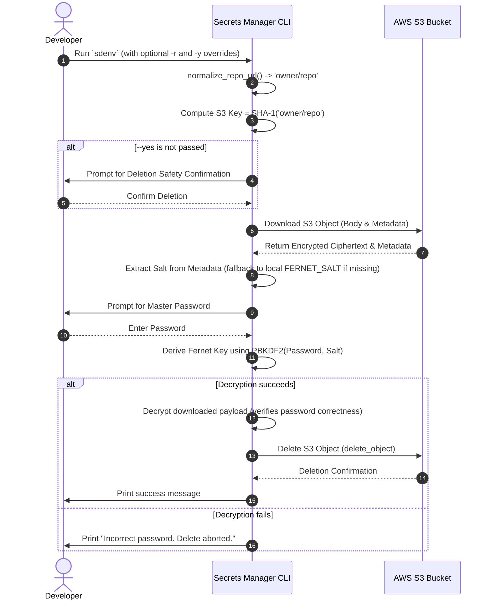

# 🔑 Authentication & Encryption Flows

This document details how Secrets Manager secures environment variables, performs cryptographic operations, and interacts with AWS S3. It explains the core concepts of S3 Key resolution, dynamic salt key derivation, and the deletion verification flow.

---

## 🔒 Security Summary

> [!IMPORTANT]
> All encryption and decryption operations occur **locally** on your development machine. Plaintext secrets are never transmitted over the network. S3 only receives and stores encrypted ciphertext.

- **Symmetric Encryption**: Fernet (AES-128 in CBC mode with HMAC-SHA256 integrity check).
- **Key Derivation**: PBKDF2HMAC (SHA-256, 480,000 iterations).
- **Dynamic Salt Management**: Every upload generates a new, cryptographically random 16-byte salt (`os.urandom(16)`), stored base64-encoded in S3 metadata.
- **Zero-Knowledge Storage**: No passwords or password hashes (even salted/slow hashes) are stored on S3.
- **Deletion Verification**: Correctness of the password is verified prior to deletion by performing a local test decryption on the S3 payload.

---

## 🏷️ S3 Key Generalization

To prevent identical repositories from resolving to different S3 keys due to different protocol configurations (e.g. HTTPS vs SSH), the CLI normalizes the git URL using the [normalize_repo_url](../src/secrets_manager/utils/helpers.py#L35-L67) function.

### URL Normalization Examples:

- `https://github.com/owner/repo.git` ➔ `owner/repo`
- `git@github.com:owner/repo.git` ➔ `owner/repo`
- `git@github.com-main:owner/repo.git` ➔ `owner/repo`
- `owner/repo` ➔ `owner/repo`

The S3 Key is calculated as `SHA-1(normalized_repo_url)`.

---

## 🗺️ Detailed Process Flows

### 1. Upload Flow (`suenv`)

This flow encrypts a local environment file and stores it in S3 with its unique generated salt.



---

### 2. Fetch Flow (`sfenv`)

This flow downloads the encrypted data from S3, extracts the salt, and decrypts the payload locally.



---

### 3. Delete Flow (`sdenv`)

This flow verifies the master password using local test decryption before requesting deletion.



---

## 💡 Cryptographic Core Details

Here is the helper code that drives the key derivation.

### Key Derivation Code:

From [helpers.py](../src/secrets_manager/utils/helpers.py#L49-L71):

```python
def get_fernet(password: str, salt: bytes = None) -> Fernet:
    """Derive a Fernet key from the password."""
    password_bytes = password.encode()
    if salt is None:
        salt_raw = os.getenv("FERNET_SALT")

        if salt_raw is None:
            print("❌ Error: FERNET_SALT not found in environment variables.")
            print("Tip: Run 'export FERNET_SALT=your_salt' or add it to ~/.bashrc")
            sys.exit(1)

        salt = salt_raw.encode()

    kdf = PBKDF2HMAC(
        algorithm=hashes.SHA256(),
        length=32,
        salt=salt,
        iterations=480000,
    )
    key = base64.urlsafe_b64encode(kdf.derive(password_bytes))
    return Fernet(key)
```
